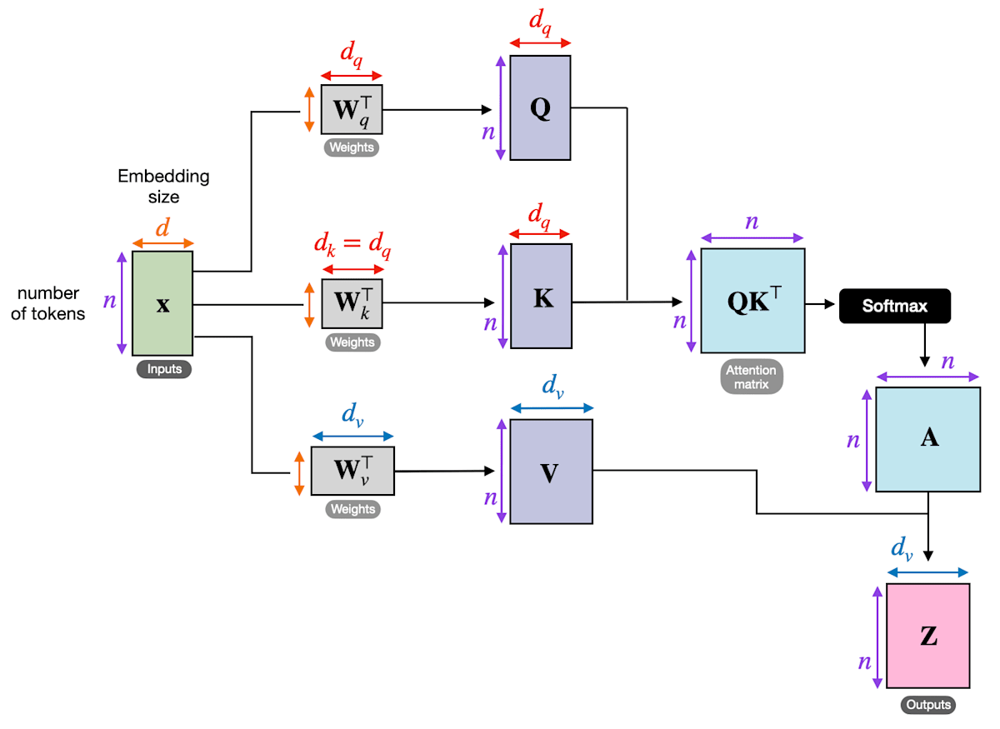
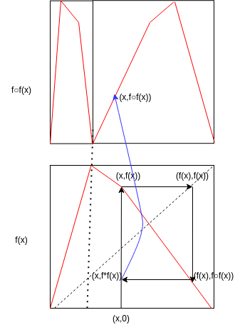
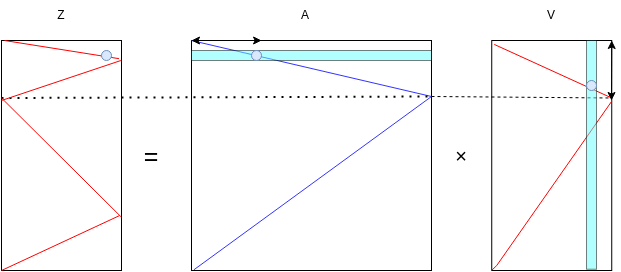
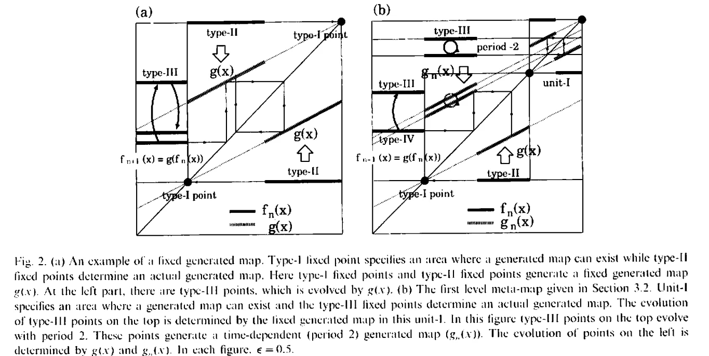
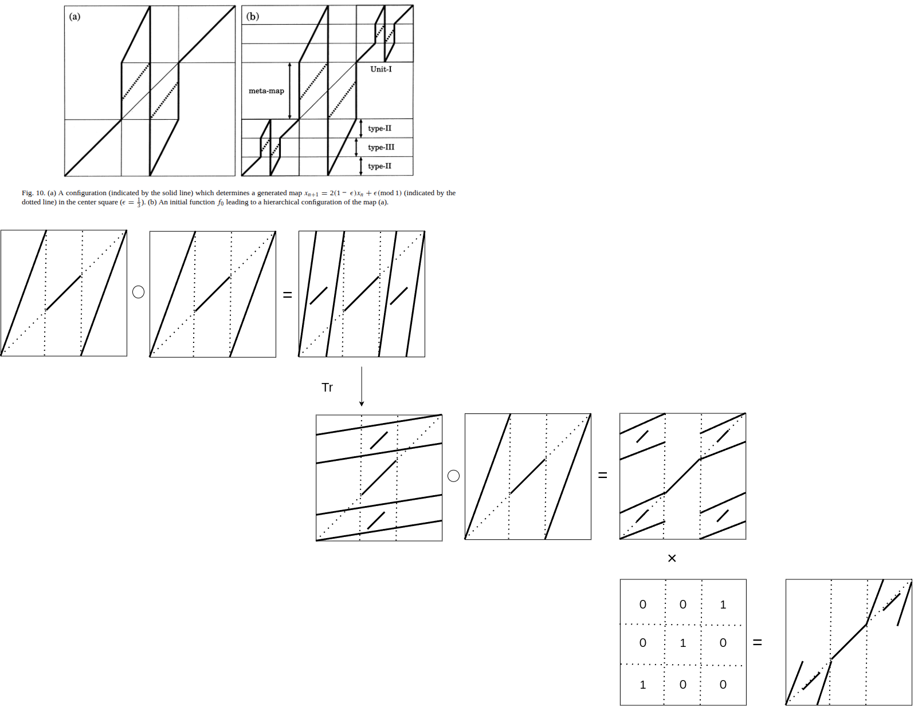

# Transformers as Functional Dynamics, equivalency between lambda calculas and linear logic
Categoriy theoretical view of transformas and functional dynamics, threre ability of higher order calculation
## Abstract
In this papaer we show the equivalence of functional dynamics and self-attention mechanism, then linear interpolation type functional dynamics whose parameter is $\epsilon$ is equivalent to the functor between functinoal dynamics from Yoneda's lemma.
From the point of view the equivalence between attention and functional dynamics, 
In-context learning, higher order logic function ability which seems transfromers, especially the part of self-attention have can be explained by symmetric monoidal closed category (SMCC) which has exponenatioal object.
SMCC is not equivalent to Cartesian closed category (CCC), both has higher order $lamda$-calculas function but we explain SMCC obeys linear logic(linear $lambda$ calculation) which one property or value can be used only once during calculation or proof.

And we state residual connection, another component of transformers "copy" data from previous layer, the constraint of linear logic is weakend and comutation ability recovers from the original SMCC.

Moreover we show MLP(Multi layer perceptron) has a function to retrive information from key-value database experimentally.

Because softmax is applied attention matrix, we can define Markov category as the object is probablistic distribution function,
the morphism is converison like Markov kernel.

As a result, one layer of a Transformer composition of Markov category and SMCC caluculate linear lambda calculation, and the property can extend nonlinear conversion such as softmax.

Related numerical experiments and theorem formulation automatic prooves are provides.

Keywords:
category theory, Transformers, sefl-attention, function vectors, function dynamical, dynamical systems, linear λ-calculus, Markov categories

----

## Introduction
Almost universal computation power of Transfomers attracta many reseachers. Especiallty universal turing machine(UTM) ,lambda calculation theory and category theory are usually use to explain them.

Cartesian closed category(CCC) is defined having objects called direct product between two objects $X\times Y$ and exponential object(ofnen written $Z^Y$) .Intuitively an exponential object$X^Y$ is set of all morphisms from X to Y.
has natural transformation $Hom(X\times Y,X)\simeq Hom(X,Z^Y)$ for objects $X,Y,Z$.

In $\lambda$ calculas or programming points of view, morphism $X→Z^Y$ is currying, $Z^Y→Z$ is $\lambda$ calculation, i.e eval of S-expression.As explained bellow eval is the oparation to generate attention matricx from matrix Q and K in transformers, function application $f\cdot f$ in functional dynamics.

But category $\bf{Vect}$ whose objects is vector space, morphisms are linear transformation can not have nonlinear diagnal product. This is not CCC but called Symmetric Monoid Closed Category(SMCC). In this categorey usual eval can not used for functions without constraint , but use linear logic deduction, which treat propositions as finite resources when it used comsumed.

In same motivation research as this paper, "Topos of Transformer Networks"(https://arxiv.org/abs/2403.18415v2)”
The assume Neural networks on category $\bf{RELU}$ whose objects are usual vector space, morphisms are partially linear map, because  Relu is usually useed as activation function. Then transformers can be treated topos, which is special case of CCC,and have univarsal higher order caluculation ability.

Linear logic is related to programming language such as Rust[] which constraint resource(such as variables) usage at one time. This reduces programming bugs. Also There is a research to connect linear logc and probablistic programming, bayesian inference [].

In this paper almost explaing about the relation between Transformers, lambda calculation and category theory. But the original idea and motivation about higher order fuction is Vector space and moprphism or category of metafunction(funcsions between funcions) is from dynamical system of functions, this is deeply related to learnability of transformers. Some theorems explained following chapter are written and proven in Lean.

### Contributions of this paper
- Points out the equivalence of self-attention and functional dynamics, property category .
- Explains the relation between self-attention and symmetric monoidal closed category (SMCC) $(\mathbf{Vect},\otimes,\multimap)$ eval-apply loop which is required for in-context learning and the correspondence between markov category and attention matrix.
- Numerical experiment about MLP function, only Key-value retirival or not.
- The proofs of formalizations are witten and proven in lean

## Preriminalies
### Attention mechanism, Transformers and their Components
Transformers are consists of several components, attention, MLP(multi layer perceptron ,FFN), softmax, residual connecctions and layer normalizations.

Fig

Attentions are product of  and input vector x.
MLP is composition of all-to-all vector product using matrix product and activation function such as Relu or softmax.
softmax function is usually used tu make attention matrix in conrast of Relu in the tail of MLP.
Residual connection (Resnet) is often used in LLM. The benefits of Resnet are not only preserving information of earlier layers during training and inference, but simplify loss landscape. Resnet with nearly identical matrix convertion are similar to differential operations  which is called neural ordinal differencial equiation(neural ODE).
Layer normalizations are another important part of transformers to regulize internal data.



Positional encoders are also important for identify the order of tokens which is encoded and put in attention mechanism.
Layered transformers is usually called large language models (LLM). LLMs have in-context learning ability[] and scalability of learning. LLMs and their variants made various applications and theoretical explanations.

Function vector(FV) [] a concept embedded in LLM as a head of transformer. FV is portable among but layer of LLM.

### Functional Dynamics
Functional dynamics (FD)[] is introduced by function of 1-dimentional function (metafunction). The original form FD is define as following

$f_{t+1}(x)=(f_t\cdot f_t)(x) +\epsilon f_t(x)$

or 

$f_{t+1}(x)=(f_t\cdot g_t)(x) +\epsilon f_t(x)$

Generally, the dynamics of functions are governed by fixed points and hieralchy of fixed points and the structure complex behavior depends on initial function f and parameter $\epsilon$[].
 Regarding a fnction as a graph drawn in 2D rectangle, function applicaton to other function ($f\cdot g$) is described as matrix multiplication. In case attention mechanism, f and g corespons to matrix, the non-zero value is  
row is x -axis, column is y-axis graph.Then a matrix not only represent 1-dimentional function graph but 

As a example $d=d_q=d_k=d_v$ for simplicity, x has only 1 nonzero value per one row. Then the elements of matrix looks a graph of 1 dimentional function of 2 dimentional region. When function f(red curve) is applied to f itself, one can plot $f(x)\cdot f(x)$ following f(x) value for each x coordinate. one peak function is converted to  2 peak function, 4 peak function ,8 peak ... and so on.


Then suppose $W$ as diagonal matrix,consider product of matrix V and attention map A, if the shape of elements of A is same as the ones of V, one can foldi graph of V by matrix product. This can be thoudht the product of  Q and K.
 さらに$Wv$を対角行列としてVとattention map Aの積を考えます。このとき図のようにAの要素もVと同様な形状をしていれば行列積によってVのグラフを折りたたむような出力が得られます。
 これはAの元になっているQの形状をKで引き伸ばすような処理によって得られます。
(出力Zの水色の点がある行を計算したい場合Aの水色の行とVのそれぞれの列との内積を取ります。この場合Aの水色の行の非零要素は水色の点しかないので、その列数(横←→)と同じ行数に非零要素があるVの列(水色)との内積しか非零になる要素はなく、結果としてAの水色と同じ行、Vの水色と同じ列のZの要素のみが非零となる)


The self reference structure can be achieved by this operation. $W_q$ is unit matrix
これによってattentionにおいて自己参照的な構造が得られることになります。Wqは単位行列でありKでその形をnxnに引き伸ばすようにすれば良さそうですがもともとのKey,Queryの意味付けと比べると消極的であるようにも見えます。別の言い方をするとattentionでは1回の繰り返しでより多くの自己参照をしていると言えます。関数マップにおけるεの調整もモデル内部で行っていると言えるかもしれません。

上で挙げた例では各行の1つの要素のみが非零の場合のみを説明しましたが、複数の要素が非零の多価関数、確率分布関数(確率過程)を変換する写像と捉えることもできます。(Transformerでは確率分布の正規化に類似した処理をsoftmax,dでの割り算で行っています。)
またここでの例では層ごとに同じ重みパラメーターを用いるものとしてGNN,関数マップとの類似性、等価性を見てきましたがattentionを用いたネットワークでは層ごとに異なるパラメーターを用いています。

f and g corresponds to morphism, the functor is functional dynamics.
In other formulation f,g are objects, functional dynamics itself is morphism and the functor is parametrize by $\epsilon$.
By restricting the formular of FD linear interpolations as in the original paper, category theory can explation  its parameters $\epsilon$.
Functor between FD and parameter $\epsilon$ is natual transformation. Yoneda's lemma $Nat(h_A,F)\simeq F(A)$ corresponds to this relation is 

One of the interesting property of FD is hierachical structure of points. Fixed points are on diagonal line called type I, type II fixed points is depends of  type III fixed points refer to ...and so on.  [].


This hierrachical structure is not merely analogy of the one of natural/programming languages but coreesponds to deduction or in-context learning process of transformers. As following figure, functional dynamics can generate self similar fractal shaped function by adding matrix operation as in attention mechanism. 
The compsition of attention ($f\cdot f$) and MLP as operators makes self recuesivee fractal shaped function easily. Fig .  shows ssteps  to make make two identical map inside the region of s map. This fact also implies self similar structure of language related to folding mechanism of FD.


The original form of FD only consists of function apply( $\cdot$ ),addition (+) and multiplication of constant value $\epsilon$ this restrict related to logic structure which transformers can calculete as following chapter.

### Category Theory
As described above,section FD and attention can be treated as some kind of Category and it should have ability to explain and evaluate functions. Lambda calculus treats functions as same as variables. All calculation in is multiple steps of evaluations(eval) and applications(apply) of formulars.
Eval is so called charactor string as a formular and calucule this, apply is the process that substitutiig eval's result to other formular. This eval-apply loop is common at the various field of computer programming.
Lambda calcuals has three rules, alpha conversion beta reduction and eta conversion. Alpha conversion is just replacement of bound variable names. Beta reduction is application of a function described by $(\lambda x. f) b=f(b)$ in usual notation. Eta conversion is desciribed as $(\lambda x. f) x=f $, here rhs and lhs are same function (constant). This is corresponds to extentionality definition of functions sets theorem.

Lambda calculus is formulate by using Cartesian closed category (CCC) which have product $X \times Y $ of tow objects X,Y and exponential object $X^Y$. There is natual bjiction $Hom(X \times Y,Z) \simeq Hom(X,Z^Y)$. There is one morphism called carring $\lambda g$ for all g and 
morphism $Z^Y→Z$ is evaluation of program(S-expression in LISP),this is coresspons to calculation of Attention matrix from Q and K, $f\cdot f$ of functional dynamics.

$$\begin{CD}
A @>{f}>> B \\
@VV{\lambda g}V @VV{g}V \\
C @ C @ .
\end{CD}$$

There is another least restricted category called Symmetric Monoid Closed Category(SMCC). SMCC do not have diagonal morphism. Intuidively diagonal morphism and its dual is copy and delete operation. When logic and proof process changes called linear logic.
This condition is common when the objects are vector space and morphisms are linear transformation because $X\times X=X^2$ is nonlinear. The category called $\bf{Vect}$.

Be aware with cardinality of exponential object is larger than the cardinality of objects. Lawvere's fixed-point theorem[] says .

Markov category(MC) is a modeling of probablistic calculation and statistical inference and induction. The object are probablistic distributions, the morphism are transition kernels between distributions. Generally MC is not CCC, 

Topos is defined CCC which has .

### Linear Logic, Linear lambda calculus
Linear logic is restriction of usual mathematical logic which only allows finite use of propositions during a deduction.

operator $A \multimap B$ means is linear implication, which signifies "deriving a conclusion by consuming a premise exactly once".

## Formulation
This chapter explains calculation ability of transformer based on the idea of functional dynmics and spesific cateories composition related to  linear logic.
As explained above, exponential object can be understood as "functions of functions" in function dynamics between  1 dimentional space, a function represent as a graph on 2D space,especially one of those functions of function.
The problem is 

### Attention is not CCC, relations with Functional dynamics, attention matrix and  expornential object
Assume that input vector of transformer x, or each row of the products between weight matrix  $Q=W_Q, K=W_K$ represents probablistic 
distribution. Attention matrices are understood as markov transition kernel, this is markov category.
Transformers are represented as composition of SMCC and Markov category.
Vectors and Matrices muptiplied by weight matrix $W_k,$W_q,$W_V$ are reguearded as parameters of output vectors $Para(Vect)$.

We show CCC has diagonal morphism $A \rightarrow  A \times A$. Because this is not linear transformation, categoryt $\bf{Vect}$ is not CCC but 
of output has linear relation. Not to destroy linear structure at softmax. For counter expample of $\bf{Vect}$ is CCC incommutable

#### softmax and Markov category
 In attention mechanism 
 can be thought as probability disutribution of  and Markov category whose objects are probability distribution
 $softmas(x)/\sqrt{d}$ here we call this simply softmax. 

### Transformers as composition of SMCC and Markov category
composition of SMCC and Markov category
The output of this category

## The restriction of linear logic is partiallyt recorved by residual connections
Linear logic restricts using a proposition (or a fact) only once a during deduction process.
This makes the efficiency of deduction per one layer lower,  but makes mutch simpler deduction program as in human programming using spesicif language like Rust[].

## The total formularation
The main statement of this paper is drawn as attention matrix is 
the data flow in a layer of transformer as composition of Markov category and SMCC is depicted as fig.

$x \xrightarrow{W_q,W_k} (Q,K) \xrightarrow{softmax,carring} A \simeq Hom(X, \multimap Y) \xrightarrow{eval} C$

$ Kl(D)(pos,pos) \ni A \simeq (internal)Hom(V\multimap V)$

$A \otimes V \rightarrow C$

Here $KL(D)$ is Kleisli category and $D$ is distribution monad. $D$ and $Kl(D)$ is the category which have kernel 
The function of MLP has not shown here. Actual function is numerical experimentally decided.

of to categories.

### proof of theorems formulation
The formal proofs of above statements written in lean is in appendix.
- Theorem 1 a layer of transformer is Kleisli morphism of composit monado M.
- Theorem 2 eval-apply is unit/counit of adjoint,  the type of λc.λx.(Φ(Ec))x is linear $\lambda$ term.
- Theorem 3 residual connection is written by (co)diagonal of biproduct, this is not !.
- Theorem 4 The two roles of the attention matrix, $Kl(D)(pos,pos)$ and $Hom(V\multimap V)$ connected by a functor.

## Numerical Experiments 
We explained attention structure, redisual connection and softmax in above forumulations  But MLP has not yet explained.
There is a statement that the function of MLP in transformer is key-value retrive [].Here we experimentally evaluate this hypothesis.

Here we show the result of relation between residual connection strength and ablity of reuse intermediate values. This hypothesis means the correlation between reuseage number $r$ and degration of model without redisual connection.

In this experiment r interaction effect is not observed. This means neither additive copy and Markov copy works as copy function solely.

Another question is that do the restriction number of variabe reuse r depend on layer number(depth) L of a transformer?
This is ecvaluate by calculating correration coefficients of several L and r. 

These code and results on github.
### Results
#### The first experiment 
#### The second experiment 

## Discussion and Perspectives
### Related works

There is some attempt to prove transformers have same ability as Universal Turing Machine.
Th basis of these researtches, dyck language and its property is also important .Insted of use S-expression, using dyck language makes 
They define Attention and MLP parametrized mprphics or functor $\rm{Para(Vect)}$.
Then  define transformers and as free monad transformation [].
In there approach ,meta-prgramming feature of attention given by exponential object is not descripted.

Analysing the relation between lamada calculas and transformers are another dicection, 

Another formilization of transformers is based on topos. 
they first showed attention is exponential morphism of a category and has $lambda$ calculation ability as we shown. And using partical linear functions (PL) this property. This is natual condition because usual transformers and DNNs use ReLu as activation function.
But they ommits nonlinearity of the function such as softmax. Approximation of softmax function by PL is avairable but the probablistic meaaing of element of attention matrix is broken. The function of MLPs are not also explained well. 
Actually they apply pretopos insted of topos in the discussion. The assumption and application range is different from this paper but core idea, exponential object as meta-function is same.

Our statement result different perspective than []and []. Reguarding transformer as linear logic. Another difference of our papaer and above research is varification hypothesis by numeical and formal experiment using programming language such as python and lean. 

Along to FV, there are spesific change meaning or expression of words to inherent type.These head do not convert just words like words2vec, but function or morphism between they called function vector. FV can be understood as 

One-step calculation ability is also important question. If complex lambda formular(or S-expression) can be evaluate and applied at one time. Make one layer wider is more efficient than more layers. This is expecially important restrict speed, power and circuit footprint condition. In chapter[] we experimentally result both MLP and softmax has retrive function, the unbalance of attentions and MLPs is 

Multi Head attentions (MHA) are also key part of transformer performance. But it is not discussed and evaluated well in this paper. Pararlell architecture may achieved different values assignment to same expression and reduction. MLPs after concat work as selecting and merging the results, which could be decided this assumption is correct or not experimentally. Mixture-of-expert is same as MHA but larger structure.

### Learnability
The success of transformers is not only higher order function programmability and in-context learning, but learnablity and avoiding local minimum, overfitting are also significant properties and affect to large application area industries.
For example, Edge of chaos hypothesis states highset learning speed is achieved when learning rate is on critical point[].
In other studies, attentions as a component of transformers tends to cluster in reccuerent structure. On the other hand MLP suffers from chaotic separation of phase spate[] which cause poor classification resulst.  As combinations of attention and MLP, transformers can be adjust learning dynamics properly to reach low loss function solution speedy. In this case changing the ration between attentions and MLPs and measure prediction performance of learned parameters is simple experiment to detect the function of edge of chaos flow.

### Learning process as category
In this paper, we show explanation of inference and generation of fuction Transformers and ability higher logical property.
To extend categoric theoretical view to the learnability of transformer, to explain this dynamical systems view required 
Because learning process cannot tread as natural transformation. sdo 2-category which has morphism of morphism as an objcet, is nesesssary to explain  
Using Cartesian reverse derivative category(CRDC) which has is an asswer. Discriminaiton 2 kinds of Jacobian $R[f]$(partial derivativs of weight parameter) and $D_A[f]$(derivatives of layer input vector), are different variables but they are connected with chain rune of differnetation. Lyapunov spectrum ,eigen values of these Jacobians rule dynamics of neural networks.

Differencial structure, spectrum and topology are additional structure of CRDC and can be described by using vocablaries of basic category theory such as functor or natural transformation.

How CRDC relates and describe lyapunov spectrum , bifurcation, learning dynamics like grokking is important question.

## Conclusions
In this paper, we show the correndence between lambda calculas and transformer, functional dynamics and explain the linear calculation ability in-context of transformers is composed Markov and SMCC categories.
### Reference
- [Attention is all you need](https://arxiv.org/abs/1706.03762)
- [Resnet](https://arxiv.org/abs/1512.03385)
- [Functional dynamics. I: Articulation process](https://cir.nii.ac.jp/crid/1360574095440074752)
- [Functional dynamics: II: Syntactic structure](https://www.sciencedirect.com/science/article/abs/pii/S0167278900002037)
- [Function Vectors in Large Language Models](https://functions.baulab.info)
- [Functional Attention](https://arxiv.org/abs/2605.31559)
- [Besic Category Theory](https://www.sas.rochester.edu/mth/sites/doug-ravenel/otherpapers/leinster-book2.pdf)
- Markov cat https://www.sciencedirect.com/science/article/pii/S0001870820302656?via%3Dihub
- CRDC [Reverse derivative categories](https://arxiv.org/abs/1910.07065)
- [Introduction to Linear Logic](https://www.brics.dk/LS/96/6/BRICS-LS-96-6.pdf)
- [programs as singular](https://arxiv.org/abs/2504.08075)
- [Rust programming language](https://rust-lang.org/)
- [The Topos of Transformer Networks](https://arxiv.org/abs/2403.18415)
- Endofunctor[Endofunctor Self-Attention as a Parametric Endofunctor: A Categorical Framework for Transformer Architectures](https://arxiv.org/abs/2501.02931)
- [Transformer Feed-Forward Layers Are Key-Value Memories](https://arxiv.org/abs/2012.14913)
https://learnmechinterp.com/topics/mlps-in-transformers/
- UTM []
- Dyck
- [Lawvere's fixed point theorem](https://ncatlab.org/nlab/show/Lawvere%27s+fixed+point+theorem)


## Appendix
### Proofs of theorems in lean
```lean
universe v u
variable {C : Type u} [Category.{v} C]
```
- Theorem 1 The softmax routing is a Kleisli morphism of a monad D, and whole layer of transformer is Kleisli morphism of composit monado M = T ∘ D.
```lean
section KleisliLayer
variable (T D : Monad C)
variable {A B : C}

/-- In `Kleisli D`, a morphism A ⟶ B is by definition a base morphism
    A ⟶ D.obj B. The softmax/Markov routing `attn : A ⟶ D.obj B` (D = the
    distribution monad) is therefore literally a Kleisli morphism of D. -/
example (attn : A ⟶ (D : C ⥤ C).obj B) :
    @Quiver.Hom (Kleisli D) _ (A : Kleisli D) (B : Kleisli D) := attn

/-- Data representing a distributive law together with the composite monad
that its omitted Beck coherence equations are intended to induce. -/
/- The original blueprint used `True` in place of Beck's four coherence
axioms. Those placeholders cannot justify construction of a composite monad.
Until those equations are formalized, the honest interface must include the
resulting monad as data. -/
structure DistribLaw (T D : Monad C) where
  law : (D : C ⥤ C) ⋙ (T : C ⥤ C) ⟶ (T : C ⥤ C) ⋙ (D : C ⥤ C)
  composite : Monad C
  composite_toFunctor : (composite : C ⥤ C) = (T : C ⥤ C) ⋙ (D : C ⥤ C)

/-- The composite monad supplied by `DistribLaw`. -/
def composeMonad (l : DistribLaw T D) : Monad C := l.composite

/-- **The whole layer as a single Kleisli morphism of the composite monad.**
    Given the composite monad M = `composeMonad`, a layer
    `layer : A ⟶ M.obj B` is exactly a morphism `A ⟶ B` in `Kleisli M`.
    Thus the two categories (Markov `Kl(D)` and the value/SMCC part carried by T)
    are unified as morphisms of the single Kleisli category `Kleisli M`. -/
example (l : DistribLaw T D)
    (layer : A ⟶ ((composeMonad T D l) : C ⥤ C).obj B) :
    @Quiver.Hom (Kleisli (composeMonad T D l)) _
      (A : Kleisli (composeMonad T D l)) (B : Kleisli (composeMonad T D l)) :=
  layer

end KleisliLayer
```
- Theorem 2 eval-apply is unit/counit of adjoint,  the type of λc.λx.(Φ(Ec))x is linear $\lambda$ term.
```lean
section EvalApply
variable [MonoidalCategory C] [MonoidalClosed C]
variable {Ctx P X Y : C}

/- Extraction E : Ctx ⟶ P_FV and realization Φ : P_FV ⟶ (X ⊸ Y).
   Here `(ihom X).obj Y` is the internal hom X ⊸ Y. -/
variable (E : Ctx ⟶ P) (Φ : P ⟶ (ihom X).obj Y)

/-- The reified, realized function  f_t = Φ ∘ E : Ctx ⟶ (X ⊸ Y).
    This is the (linear) λ-abstraction / "choose" morphism. -/
def curriedFn : Ctx ⟶ (ihom X).obj Y := E ≫ Φ

/-- Application: uncurrying the reified function, X ⊗ Ctx ⟶ Y. -/
def applyMor : X ⊗ Ctx ⟶ Y := MonoidalClosed.uncurry (E ≫ Φ)

/-- **eval-apply.**  Applying the reified function equals "build it (X ◁ (E ≫ Φ)),
    then evaluate", where the evaluation `ihom.ev X` is exactly the counit of the
    adjunction `(tensorLeft X) ⊣ (ihom X)`.  This is the categorical content of
    `(Φ (E c)) x = eval (Φ (E c), x)`. -/
theorem apply_eq_build_then_ev :
    applyMor E Φ = (X ◁ (E ≫ Φ)) ≫ (ihom.ev X).app Y := by
  unfold applyMor
  rw [MonoidalClosed.uncurry_eq]

/-- **β-conversion** = the counit triangle: uncurry (curry g) = g. -/
theorem beta (g : X ⊗ Ctx ⟶ Y) :
    MonoidalClosed.uncurry (MonoidalClosed.curry g) = g :=
  MonoidalClosed.uncurry_curry g

/-- **η-conversion** = the unit triangle: curry (uncurry h) = h. -/
theorem eta (h : Ctx ⟶ (ihom X).obj Y) :
    MonoidalClosed.curry (MonoidalClosed.uncurry h) = h :=
  MonoidalClosed.curry_uncurry h

/-
  The term  λc. λx. (Φ (E c)) x  of linear λ-calculus, of type
  Ctx ⊸ (X ⊸ Y), DENOTES `curriedFn E Φ : Ctx ⟶ (ihom X).obj Y`, and its
  applied form denotes `applyMor E Φ`. Theorems `apply_eq_build_then_ev`, `beta`,
  `eta` are the semantic (SMCC) counterparts of the term's typing plus β/η.

  A *syntactic* soundness theorem — "this linear-λ term is well-typed with each
  variable used exactly once, and its denotation is `applyMor`" — requires a
  formalized linear type system (contexts as multisets, ⊸-intro/elim, a
  no-contraction/no-weakening discipline) that Mathlib does NOT provide. That is
  a separate development; here we formalize the denotation only.
-/

/-- Naturality bookkeeping: uncurrying commutes with precomposition by E,
    i.e. the "choose then apply" pipeline composes as expected. -/
theorem apply_factor :
    applyMor E Φ = (X ◁ E) ≫ MonoidalClosed.uncurry Φ := by
  unfold applyMor
  rw [MonoidalClosed.uncurry_natural_left]

end EvalApply
```
- Theorem 3 residual connection is written by (co)diagonal of biproduct, this is not !.
```lean
section Residual
variable [Preadditive C] [HasBinaryBiproducts C]
variable {A : C}

/-- The additive diagonal Δ_⊕ : A ⟶ A ⊞ A (fan-out along the depth axis). -/
def diagAdd (A : C) : A ⟶ A ⊞ A := biprod.lift (𝟙 A) (𝟙 A)

/-- The additive codiagonal ∇_⊕ : A ⊞ A ⟶ A (write-back). -/
def codiagAdd (A : C) : A ⊞ A ⟶ A := biprod.desc (𝟙 A) (𝟙 A)

/-- **Residual as additive copy (clean form).**
    `biprod.lift (𝟙) f ≫ biprod.desc (𝟙) (𝟙) = 𝟙 + f`.
    The two branches Δ_⊕ produces are summed back by ∇_⊕ into a SINGLE
    resource `𝟙 + f`; this is why the residual copies additively but supplies
    no independent second consumption. -/
theorem residual_eq (f : A ⟶ A) :
    biprod.lift (𝟙 A) f ≫ biprod.desc (𝟙 A) (𝟙 A) = 𝟙 A + f := by
  simp [biprod.lift_desc]

/-
**Residual as Δ_⊕ ≫ (id ⊞ f) ≫ ∇_⊕.**
    Same statement, written through the diagonal / map / codiagonal, matching
    the string-diagram reading.
-/
theorem residual_eq_diag (f : A ⟶ A) :
    diagAdd A ≫ biprod.map (𝟙 A) f ≫ codiagAdd A = 𝟙 A + f := by
  simp +decide [ diagAdd, codiagAdd, ← Category.assoc ];
  grind +suggestions

/-
The original proposed theorem `no_tensor_diagonal_of_noncartesian` was
incorrect: in a preadditive monoidal category the family of zero maps is always
such a natural diagonal.  A counit, including its normalization and naturality,
is needed to derive the advertised obstruction.

A natural, normalized family of discarding maps would make the tensor unit
terminal. Hence such a family cannot exist when the tensor unit is not
terminal. This is the part of the obstruction to a uniform copying/discarding
comonoid structure that follows directly from non-cartesianness.
-/
omit [Preadditive C] [HasBinaryBiproducts C] in
theorem no_natural_discard_of_nonterminal_unit
    [MonoidalCategory C]
    (hNonterminal : IsEmpty (Limits.IsTerminal (𝟙_ C))) :
    ¬ ∃ ε : (A : C) → (A ⟶ 𝟙_ C),
        ε (𝟙_ C) = 𝟙 (𝟙_ C) ∧
        (∀ {A B : C} (g : A ⟶ B), g ≫ ε B = ε A) := by
  rintro ⟨ε, hunit, natural⟩
  apply hNonterminal.false
  refine Limits.IsTerminal.ofUniqueHom ε ?_
  intro X m
  simpa [hunit] using natural m

end Residual

```
- Theorem 4  The two roles of the attention matrix, $Kl(D)(pos,pos)$ and $Hom(V\multimap V)$ connected by a functor.
```lean
section RepresentationFunctor
variable (D : Monad C)

/-- **The representation functor `F_V` (Type-valued), FULLY PROVED functorial.**
    A probability kernel `A` is sent to the value-mixing operator on `pos ⟶ V`.
    `map_id` uses the unit of the monad and of the algebra; `map_comp` uses the
    multiplication, its naturality, and the algebra's associativity. No strength,
    no `sorry`. -/
def valuePresheaf (Valg : D.Algebra) : (Kleisli D)ᵒᵖ ⥤ Type v where
  obj X := X.unop ⟶ Valg.A
  map {X Y} A := fun val => A.unop ≫ (D : C ⥤ C).map val ≫ Valg.a
  map_id X := by
    funext val
    simp only [unop_id]
    -- Kleisli identity is the monad unit η; then η-naturality + algebra unit.
    show D.η.app X.unop ≫ (D : C ⥤ C).map val ≫ Valg.a = val
    rw [← Category.assoc, ← D.η.naturality val, Category.assoc, Valg.unit,
        Category.comp_id]
  map_comp {X Y Z} A B := by
    funext val
    -- opposite comp unops to reversed Kleisli comp
    --   (A ≫ B).unop = B.unop ≫_Kl A.unop = B.unop ≫ D.map A.unop ≫ μ ;
    -- expand D.map of the composite on the right, then μ-naturality + algebra assoc.
    show (B.unop ≫ (D : C ⥤ C).map A.unop ≫ D.μ.app X.unop)
            ≫ (D : C ⥤ C).map val ≫ Valg.a
        = B.unop ≫ (D : C ⥤ C).map (A.unop ≫ (D : C ⥤ C).map val ≫ Valg.a) ≫ Valg.a
    rw [Functor.map_comp, Functor.map_comp]
    simp only [Category.assoc]
    rw [D.μ.naturality_assoc, Valg.assoc]

/-- **Functoriality made explicit: the kernel action respects Kleisli identity.**
    `A = η` (the deterministic "stay put" kernel) acts as the identity operator. -/
theorem valuePresheaf_map_id (Valg : D.Algebra) (X : (Kleisli D)ᵒᵖ) :
    (valuePresheaf D Valg).map (𝟙 X) = id :=
  (valuePresheaf D Valg).map_id X

/-- **and respects Kleisli composition (Chapman–Kolmogorov ↦ operator comp).** -/
theorem valuePresheaf_map_comp (Valg : D.Algebra) {X Y Z : (Kleisli D)ᵒᵖ}
    (A : X ⟶ Y) (B : Y ⟶ Z) :
    (valuePresheaf D Valg).map (A ≫ B)
      = (valuePresheaf D Valg).map A ≫ (valuePresheaf D Valg).map B :=
  (valuePresheaf D Valg).map_comp A B

end RepresentationFunctor

```
