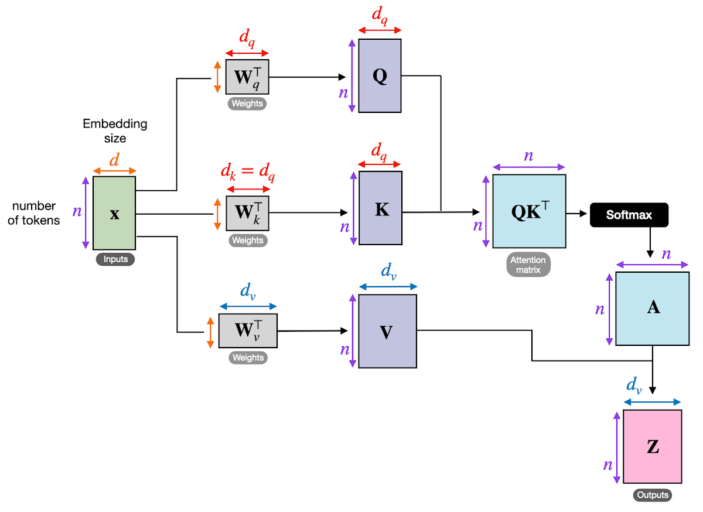
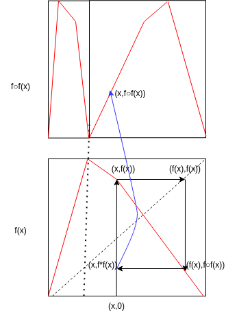
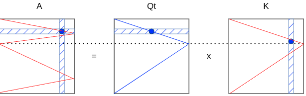
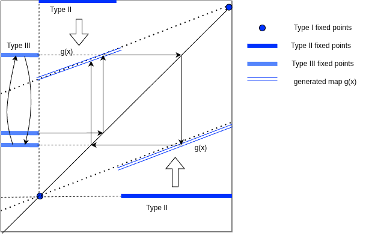
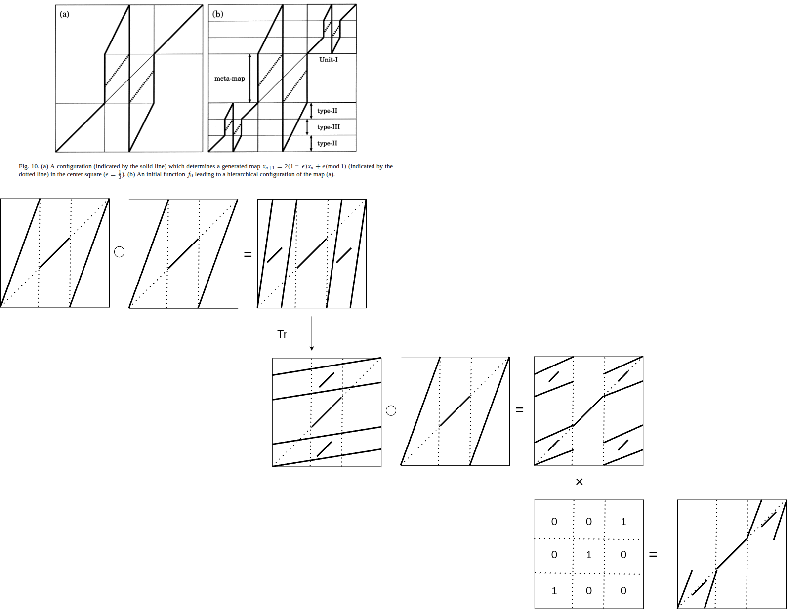

# Transformers as a Composite of a Markov Category and a Symmetric Monoidal Closed Category
# Abstract
We give a compositional categorical account of a single Transformer layer. The value path of self-attention is a morphism of the symmetric monoidal closed category (SMCC) $(\mathbf{Vect},\otimes,\multimap)$, whose internal language is multiplicative intuitionistic linear logic (MILL); under a linear approximation this lets us read in-context computation as a linear $\lambda$-term. 
The MLP acts as a non-linear realization map and, empirically, as a key–value memory. The residual connection supplies an additive copy (the biproduct diagonal), which is a legitimate but weaker notion of copy than the forbidden multiplicative diagonal and than the exponential modality. The softmax attention matrix is a morphism of a Markov category — the Kleisli category of the distribution monad — and value mixing is the action of the associated $D$-algebra (expectation). 
Consequently a Transformer layer is naturally written as a composite of a Markov category and an SMCC, plus an additive/non-linear layer, rather than as any single closed category. 

# Introduction
Almost universal computation power of Transfomers attracta many reseachers. Especiallty universal turing machine(UTM) ,lambda calculation theory and category theory are usually use to explain them.

Cartesian closed category(CCC) is defined having objects called direct product between two objects $X\times Y$ and exponential object(ofnen written $Z^Y$) .Intuitively an exponential object$X^Y$ is set of all morphisms from X to Y.
has natural transformation $Hom(X\times Y,X)\simeq Hom(X,Z^Y)$ for objects $X,Y,Z$.

In $\lambda$ calculas or programming points of view, morphism $X→Z^Y$ is currying, $Z^Y→Z$ is $\lambda$ calculation, i.e eval of S-expression.As explained bellow eval is the oparation to generate attention matricx from matrix Q and K in transformers, function application $f\cdot f$ in functional dynamics.

But category $\bf{Vect}$ whose objects is vector space, morphisms are linear transformation can not have nonlinear diagnal product. This is not CCC but called Symmetric Monoid Closed Category(SMCC). In this categorey usual eval can not used for functions without constraint , but use linear logic deduction, which treat propositions as finite resources when it used comsumed.

In same motivation research as this paper[Topos],The assume Neural networks on category $\bf{RELU}$ whose objects are usual vector space, morphisms are partially linear map, because Relu is usually useed as activation function. Then transformers can be treated topos, which is special case of CCC,and have univarsal higher order caluculation ability.

Linear logic is related to programming language such as Rust[Rust] which constraint resource(such as variables) usage at one time. This reduces programming bugs. Also There is a research to connect linear logc and probablistic programming, bayesian inference[Murfet2025].

In this paper almost explaining about the relation between Transformers, lambda calculation and category theory. But the original idea and motivation about higher order fuctions of Vector space and moprphism or category of metafunction(funcsions between funcions) is from dynamical system of functions, this is deeply related to learnability of transformers. Some theorems explained following chapter are written and proven in Lean.

### Contributions of this paper
- Points out the equivalence of self-attention and functional dynamics, property category .
- Explains the relation between self-attention and symmetric monoidal closed category (SMCC) $(\mathbf{Vect},\otimes,\multimap)$ eval-apply loop which is required for in-context learning and the correspondence between markov category and attention matrix.
- Numerical experiment about MLP function is only Key-value retirival or not. Comparison with different architectures (RNN,SSM) and ablation to find which components are responsible for this performance.
- The proofs of formalizations are witten and proven in lean

Reading the residual stream as a linear polynomial extension $\mathcal{K}[x]$, the "apply" of the loop is derived, not posited: it is the evaluation counit of the abstraction–application adjunction that the (linear) deduction theorem produces from the polynomial extension in the sense of Lambek and Došen. 
We ground each component in the existing categorical foundations of machine learning, embed results from a controlled experiment that localizes the copy structure in softmax and the applied value in the MLP, and leave the Function-Vector experiments as clearly marked placeholders to be filled from a real language model. 
On expressivity we defer to the topos analysis of Villani and McBurney[Topos], whose piecewise-linear base is for ReLU networks and whose choose∘eval decomposition independently reaches the eval–apply reading; we measure a different quantity, resource structure, which a cartesian model cannot see. 
In the linear/PL-input regime the value path — residual copy included — is expressible in $!$-free intuitionistic linear $\lambda$-calculus, and the hypothesis that the model performs only such resource-linear computation cannot be excluded; our experiments support rather than merely fail to refute it.

# Preriminalies

### Attention mechanism, Transformers and their Components
Transformers are consists of several components, attention, MLP(multi layer perceptron ,FFN), softmax, residual connecctions and layer normalizations.

Attentions are product of  and input vector x.
MLP is composition of all-to-all vector product using matrix product and activation function such as Relu or softmax.
softmax function is usually used tu make attention matrix in conrast of Relu in the tail of MLP.
Residual connection (Resnet) is often used in LLM. The benefits of Resnet are not only preserving information of earlier layers during training and inference, but simplify loss landscape. Resnet with nearly identical matrix convertion are similar to differential operations  which is called neural ordinal differencial equiation(neural ODE).
Layer normalizations are another important part of transformers to regulize internal data.

Positional encoders are also important for identify the order of tokens which is encoded and put in attention mechanism.
Layered transformers is usually called large language models(LLM). LLMs have in-context learning ability[ICL][ICLgd] and scalability of learning. LLMs and their variants made various applications and theoretical explanations.

Function vector(FV) [FV] a concept embedded in LLM as a head of transformer. FV is portable among but layer of LLM.

### Functional Dynamics
Functional dynamics (FD)[FD1] is introduced by function of 1-dimentional function (metafunction). The original form FD is define as following

$f_{t+1}(x)=(f_t\cdot f_t)(x) +\epsilon f_t(x)$

or 

$f_{t+1}(x)=(f_t\cdot g_t)(x) +\epsilon f_t(x)$

Generally, the dynamics of functions are governed by fixed points and hieralchy of fixed points and the structure complex behavior depends on initial function f and parameter $\epsilon$[FD2].
Regarding a function as a graph drawn in 2D rectangle, function applicaton to other function ($f\cdot g$) is described as matrix multiplication. In case attention mechanism, f and g corespons to matrix, the non-zero value is  
row is x -axis, column is y-axis graph.Then a matrix not only represent 1-dimentional function graph but 

As a example $d=d_q=d_k=d_v$ for simplicity, x has only 1 nonzero value per one row. Then the elements of matrix looks a graph of 1 dimentional function of 2 dimentional region. When function f(red curve) is applied to f itself, one can plot $f(x)\cdot f(x)$ following f(x) value for each x coordinate. one peak function is converted to  2 peak function, 4 peak function ,8 peak ... and so on.

In case $W$s are diagonal matrices, consider product of matrix $Q^T$ ,K and attention map A, if the shape of elements of Q is same as the ones of K, one can fold graph of $Q^$ or K by matrix product. This can be thought the attention matrix A, which is the product of Q and K. 

When calculating the row of A where blue point exist, multiply product of blue row of Q and each column of K. In this case the only elements that are nonzero are those resulting from the dot product with the column of K (blue) that has nonzero elements in the same number of rows as that number of columns; consequently, only the elements of A that are in the same row as the blue elements of Q and the same column as the blue elements of K are nonzero.
The self reference structure can be achieved by this operation. 

Since $W_q$ is an identity matrix, it might seem sufficient to simply use K to expand it to an nxn shape, but this approach appears somewhat passive when compared to the original meanings of “Key” and “Query”. In other words, one could say that attention performs more self-references in a single iteration. It might also be said that the adjustment of ε in the function map is performed internally by the model.

The above example is only one element of each rows is non-zero, in case multiple elements are non-zero FD can be thought as converter of multi valued function of probablistic distribution function (probablistic process).In transformers renormalization for probablistic distribution function is calulated by softmax and division by $\sqrt{d}$.
In this paper we only treat same weight parameter for each layers compare to FV and attentions, recently this is called looped transformer and paid attention with researchers[loopedTr].

One of the interesting property of FD is hierachical structure of points. Fixed points are on diagonal line called type I, type II fixed points is depends on type III fixed points refer to ...and so on[FD].

This hierrachical structure is not merely analogy of the one of natural/programming languages but coreresponds to the deduction or in-context learning process of transformers. As in following figure, functional dynamics can generate self similar fractal shaped function by adding matrix operation as in attention mechanism. 
The compsition of attention ($f\cdot f$) and MLP as operators makes self recuesivee fractal shaped function easily. Fig .  shows ssteps  to make make two identical map inside the region of s map. This fact also implies self similar structure of language related to folding mechanism of FD.

The original form of FD only consists of function apply( $\cdot$ ),addition (+) and multiplication of constant value $\epsilon$ this restrict related to logic structure which transformers can calculete as following chapter.

## Category Theory
As described above,section FD and attention can be treated as some kind of Category and it should have ability to explain and evaluate functions. Lambda calculus treats functions as same as variables. All calculation in is multiple steps of evaluations(eval) and applications(apply) of formulars.
Eval is so called charactor string as a formular and calucule this, apply is the process that substitutiig eval's result to other formular. This eval-apply loop is common at the various field of computer programming.
Lambda calcuals has three rules, alpha conversion beta reduction and eta conversion. Alpha conversion is just replacement of bound variable names. Beta reduction is application of a function described by $(\lambda x. f) b=f(b)$ in usual notation. Eta conversion is desciribed as $(\lambda x. f) x=f $, here rhs and lhs are same function (constant). This is corresponds to extentionality definition of functions sets theorem.

Lambda calculus is formulate by using Cartesian closed category (CCC) which have product $X \times Y $ of tow objects X,Y and exponential object $X^Y$. There is natual bjiction $Hom(X \times Y,Z) \simeq Hom(X,Z^Y)$. There is one morphism called carring $\lambda g$ for all g and 
morphism $Z^Y→Z$ is evaluation of program(S-expression in LISP),this is coresspons to calculation of Attention matrix from Q and K, $f\cdot f$ of functional dynamics.

$$\begin{CD}
A @>{f}>> B \\
@VV{\lambda g}V @VV{g}V \\
C @ C @ .
\end{CD}$$

There is another least restricted category called Symmetric Monoid Closed Category(SMCC). SMCC do not have diagonal morphism. Intuidively diagonal morphism and its dual is copy and delete operation. When logic and proof process changes called linear logic.
This condition is common when the objects are vector space and morphisms are linear transformation because $X\times X=X^2$ is nonlinear. The category called $\bf{Vect}$.

Be aware with cardinality of exponential object is larger than the cardinality of objects as Lawvere's fixed-point theorem[Lawvere] says.

Markov category(MC) is a modeling of probablistic calculation and statistical inference and induction. The object are probablistic distributions, the morphism are transition kernels between distributions. Generally MC is not CCC, 

Topos is defined CCC which has subobject classifiers $Sub: C^{op}\rightarrow Set$.

Intuitively function f and g of FD corresponds to morphisms, the functor is functional dynamics. In other formulation f,g are objects, functional dynamics itself is morphism and the functor is parametrize by $\epsilon$. By restricting the formular of FD linear interpolations as in the original paper[FD], category theory can explation its parameters $\epsilon$. Functor between FD and parameter $\epsilon$ can be thought natual transformation.

Yoneda's lemma explains the relation between the behavior and parameters FD. According to Yoneda's lemma, for a category C, and a functor from C to othre category D.
$F(x) \leftrightarrow , x \in C, F: C^{op}$
C^{op}$ is the opposite category of C which morphics is reverse directino to C.

Hom functor $Hom_C(-,X)$ maps object A to a set of morphisms $Hom_C(A,X), morphism f: to set of morphism of morphism.
There are natural transformations $Nat(h_X,h_Y) (h_X \rightarrow h_Y)$. Yoneda's lemma states for any functor F $Nat(h_X,F) \simeq F(X) $.
This means a natrual transformation between FD F and G corresponds to a specific parameter. In case of linear interpolation FD, this is parameter $epsilon$. Here we identify attention matrix dynamics along layers is functional dynamics. The change of attention matrix dynamics along to layers can be said natural transformation and there is a specific object(values) maped by a functor F.

### Existing categorical foundations of machine learning

Our decomposition builds on an established body of categorical machine-learning theory, which we use rather than re-derive.

**Gradient-based learning as parametric lenses.** Fong, Spivak and Tuyéras [2019] framed supervised learning functorially ("backprop as functor"). Cruttwell, Gavranović, Ghani, Wilson and Zanasi [2022] gave a categorical semantics of gradient-based learning in terms of *parametrised maps* ($\mathrm{Para}$), *lenses*, and *reverse derivative categories* (RDC), unifying optimisers (SGD, Adam, Nesterov) and losses (MSE, softmax cross-entropy) as instances of a single parametric-lens structure. Elliott [2018] gave the "simple essence" of automatic differentiation as compilation to categories. These works supply the *learning* side of the picture; they are agnostic to the forward architecture.

**Reverse derivative categories.** Cockett et al. [2020] axiomatize the reverse derivative $R[f]:A\times B\to A$ (backpropagation, $J^\top y$ in $\mathbf{SMOOTH}$) and show it equals a forward derivative plus a dagger structure on the subcategory of linear maps, which form an additively enriched category with dagger biproducts. This is the setting in which our two Jacobians (state vs parameter) and the additive biproduct structure of §5 live.

**Architectures as (co)algebras.** Gavranović et al. [2024] ("Categorical Deep Learning") present architectures as (co)algebras over (co)monads via polynomial functors. O'Neill et al. [2025] specifically formalize self-attention as a parametric endofunctor in $\mathrm{Para}(\mathbf{Vect})$, restricted to the linear components — directly the SMCC/value-path fragment we use in §3.

**Probabilistic structure.** Fritz [2020] axiomatizes Markov categories; the Kleisli category of the distribution monad is the canonical example. Shiebler, Gavranović and Wilson [2021], surveying category theory in machine learning, already treat learners as parametrised stochastic processes and distinguish a *co-Kleisli* composition (in which randomness is shared) from a *$\mathrm{Para}$* composition — a precedent for combining probabilistic (Markov) with parametric structure, which is exactly the join we make explicit for attention in §6–7.

**Expressivity via topos theory.** Villani and McBurney [2024] analyze the *expressivity* of the architecture through topos theory. They decompose self-attention into a **choose** morphism — an input-dependent selection of parameters, which parameterises a feed-forward architecture — followed by an **eval** morphism that computes the output using the chosen architecture; the layer is thus a linear function whose coefficients are computed by a function that outputs a function, to which a canonical evaluation is then applied. On this basis, convolutional, recurrent and graph-convolutional networks embed in a pretopos of piecewise-linear (PL) functions, whereas the transformer necessarily lives in its topos completion, so that the two families instantiate different fragments of logic: the former first-order, the transformer a higher-order reasoner.

This is an important and, we believe, correct result *about expressivity*, and their choice of a PL base is well-motivated: ReLU networks are exactly piecewise-linear. Their choose∘eval decomposition is an independent, architecture-level arrival at the same eval–apply reading we develop from Function Vectors (§3.3–3.4): their input-dependent "choose" is our extraction $E:\mathrm{Ctx}\to P_{FV}$, and their canonical evaluation is our counit $\mathrm{ev}$. We do not contest their expressivity claim; §9 explains why the present paper nonetheless measures a different quantity. (See also Belfiore and Bennequin [2021] for topos-and-stack models of deep networks.)

**The linear-logic side.** SMCCs are the standard categorical models of multiplicative intuitionistic linear logic; the SMCC ↔ (linear) λ-calculus correspondence is the linear analogue of the Curry–Howard–Lambek correspondence between CCCs and the simply-typed λ-calculus, with roots in the differential/linear-logic tradition (Ehrhard–Regnier). This is what licenses the linear-λ reading in §3.

**Mechanistic anchors.** Geva et al. [2021, 2022] show feed-forward layers act as key–value memories writing into the residual stream (§4). Todd et al. [2024] introduce Function Vectors, compact task representations that *trigger* rather than perform a task, invoking Church's λ-calculus (§3.3, §8.2).

## Linear Logic, Linear lambda calculus
Linear logic is restriction of usual mathematical logic which only allows finite use of propositions during a deduction.

operator $A \multimap B$ means is linear implication, which signifies "deriving a conclusion by consuming a premise exactly once".

# Formulation
## Summary related categories

The claim examined here is narrow and structural: a Transformer layer is not modelled by one symmetric monoidal closed category, but by a **composite**

$$
\underbrace{\mathrm{Kl}(D)}_{\text{softmax: Markov category}}
\;\xrightarrow{\;D\text{-algebra (expectation)}\;}\;
\underbrace{(\mathbf{Vect},\otimes,\multimap)}_{\text{value path: SMCC} \;\leftrightarrow\; \text{linear }\lambda\text{-calculus}}
\;\xrightarrow{\;\Phi=\text{MLP}\;}\;
\underbrace{(X\multimap Y)}_{\text{realization / apply}}
\;+\;
\underbrace{(\mathbf{Vect},\oplus)}_{\text{residual: additive copy}} .
$$

Four sub-claims make this up: (i) the attention value path is an SMCC morphism and therefore admits a linear-λ reading (§3); (ii) the MLP is a realization map / key–value memory (§4); (iii) the residual connection realizes a copy, but only in the additive sense (§5); (iv) softmax is a Markov-category morphism (§6). Section 7 assembles the composite, §8 reports experiments, and §9 positions the account against prior work.

## Self-attention's value path as an SMCC, and the linear-λ reading

### The SMCC and its internal language

Work in $(\mathbf{Vect}_k,\otimes,I=k)$, a symmetric monoidal closed category with internal hom $A\multimap B=\mathrm{Hom}_k(A,B)$, tensor–hom adjunction $\mathrm{Hom}(C\otimes A,B)\cong\mathrm{Hom}(C,A\multimap B)$ (currying), and evaluation counit

$$\mathrm{ev}_{A,B}:(A\multimap B)\otimes A\longrightarrow B,$$

which is bilinear, hence a genuine linear morphism from the tensor. This is the categorical content of "evaluation is available for linear maps". Crucially $\mathbf{Vect}$ has **no** natural diagonal $\Delta:A\to A\otimes A$ (the map $a\mapsto a\otimes a$ is non-linear), so copy/delete are absent from the multiplicative fragment. The internal language of this SMCC is MILL $(\otimes,\multimap,I)$: types are objects, terms are morphisms, $\multimap$-introduction is currying, $\multimap$-elimination is $\mathrm{ev}$, and the linearity discipline ("each variable used exactly once") is the categorical absence of the diagonal.

### The linear approximation

To keep evaluation non-trivial we freeze the softmax pattern (treat the attention weights as a query-independent constant) while retaining the *bilinear* value path $V=W_v h$ and the query–value contraction. A fully linearized forward pass would collapse an additive intervention to a translation and trivialize $\multimap$; the frozen-pattern approximation instead preserves the counit $\mathrm{ev}$. All λ-typing below is under this approximation; §6 restores the softmax as a Markov morphism.

### Function Vectors as points; realization and application

The reference Function-Vector construction sums, over the top heads, the out-projection of head activations at the last token, yielding a vector in $\mathbb{R}^d=\mathbb{R}^{\mathrm{resid\_dim}}$. An FV is therefore a **point** of a parameter object $P_{FV}\subset\mathbb{R}^d$, not an element of the internal hom $X\multimap Y\cong\mathbb{R}^{d\times d}$. Bridging this dimension gap requires a **realization map** $\Phi:P_{FV}\to(X\multimap Y)$. The task index $t$ is data (inferred from context), not a free parameter; we separate extraction and application:

$$E:\mathrm{Ctx}\multimap P_{FV},\qquad A:=\mathrm{ev}\circ(\Phi\otimes\mathrm{id}_X):P_{FV}\otimes X\to Y,\qquad v_t=E(\mathrm{ctx}_t).$$

### In-context computation as a linear λ-term

With $E,\Phi$ as constants and using currying, one forward pass of ICL is well-typed in linear λ-calculus:

$$
\dfrac{c:\mathrm{Ctx}\vdash \Phi(E\,c):X\multimap Y \qquad x:X\vdash x:X}
{c:\mathrm{Ctx},\,x:X\vdash (\Phi(E\,c))\,x:Y}\;(\multimap\text{-elim}=\mathrm{ev})
\qquad\Longrightarrow\qquad
\boxed{\;\lambda c.\,\lambda x.\,(\Phi(E\,c))\,x\;:\;\mathrm{Ctx}\multimap(X\multimap Y)\;}
$$

Both $c$ and $x$ are used exactly once, so the term is linear. The type $\mathrm{Ctx}\multimap(X\multimap Y)$ says the context compiles to a *function-typed value*: the FV $E(c)$ is a reified function reference (a first-class datum), $\Phi$ resolves it to a procedure, and $\mathrm{ev}$ applies it — a precise reading of "the vector triggers, but does not perform, the task" [Todd et al. 2024].

### The residual stream as a polynomial extension; the abstraction–application adjunction

The categorical basis of λ-abstraction is Lambek's **functional completeness** [Lambek 1974], realized through the **polynomial extension** $\mathcal{C}[x]$: adjoining an indeterminate arrow $x:1\to A$ yields a category $\mathcal{C}[x]$ in which every polynomial morphism corresponds uniquely to a morphism of $\mathcal{C}$, so $\mathcal{C}[x](B,C)\cong\mathcal{C}(A\times B,C)$ and, by closedness, $\cong\mathcal{C}(B,A\Rightarrow C)$ — categorical λ-abstraction.

Došen [2001] refines this into two adjunctions. The inclusion $I:\mathcal{C}\to\mathcal{C}[x]$ of a cartesian closed category into its polynomial extension has a **left adjoint based on product** ($A\times-$) and a **right adjoint based on exponentiation** ($A\Rightarrow-$); composing the two — which, as Došen notes, stem from the deduction theorem — produces the product–exponentiation adjunction $A\times-\dashv A\Rightarrow-$. In it, **application is the counit** $\mathrm{ev}:(A\Rightarrow C)\times A\to C$ and **abstraction is the unit**, with β- and η-conversion the two triangle identities (the inversion principle Došen draws in parallel with comprehension/extensionality). This *is* the eval–apply structure: apply $=$ counit (evaluation), abstract $=$ unit.

Two adaptations are forced here.

**(i) Linear polynomial extension.** In the SMCC $(\mathbf{Vect},\otimes,\multimap)$ the indeterminate must be **linear** (used exactly once), so the product-based left adjoint becomes the tensor $A\otimes-$ and the exponentiation-based right adjoint becomes $A\multimap-$. Došen's composed adjunction becomes the **tensor–hom adjunction $A\otimes-\dashv A\multimap-$** of §3.1, whose counit is exactly the evaluation $\mathrm{ev}:(A\multimap B)\otimes A\to B$ used to type application in §3.3–3.4. The "apply" of the eval–apply loop is thus not posited but **derived**: it is the counit of the adjunction that the (linear) deduction theorem produces from the polynomial extension.

**(ii) The residual stream as $\mathcal{K}[x]$.** Identify the running residual value with the indeterminate: the residual stream *is* the polynomial extension $\mathcal{K}[x]$, threading $x$ across depth. By §5 the residual copies $x$ only **additively** (the $\oplus$-diagonal), never multiplicatively, so the indeterminate is genuinely linear — carried across layers but never squared in a $\otimes$-context. The residual therefore instantiates the linear polynomial extension whose adjunction yields apply, and the FV-extraction map $E$ of §3.3 is the (linear) **abstraction** direction — the unit side — reifying the context as a function-typed value.

**Precision: value level vs type level.** The adjunction furnishes *linear* abstraction/application: substitution of a once-used indeterminate, the analogue of a single β-step. Full λ-abstraction with unrestricted binding and reuse of the bound variable would require the exponential $!$, which §5 shows is absent. So $\mathcal{K}[x]$ and the Došen adjunction supply application/abstraction at the **value level**, not unrestricted type-level λ-abstraction with free duplication — consistent with the once-only discipline of the whole account: the eval–apply loop is linear, and the polynomial extension generating its apply-counit is a linear one.

## The MLP as realization and key–value memory

The MLP is best read not as evaluation but as the (non-linear) realization map $\Phi:P_{FV}\to(X\multimap Y)$ that converts an FV point into an applied function. This is consistent with the mechanistic result that feed-forward layers act as **key–value memories**: each key correlates with input patterns and each value induces an output distribution, with the layer output a composition of memories refined through the residual stream [Geva et al. 2021, 2022]. In our composite the MLP writes additively into the residual (the $\oplus$ side of §5) while realizing the currying step of §3. It is therefore the natural carrier of $\Phi$, and we test this localization in §8 (Probe B, Probe C).

## The residual connection as additive copy

A residual connection is $x\mapsto x+f(x)=(\mathrm{id}_A+f)(x)$, a sum of parallel morphisms, legitimate because $\mathbf{Vect}$ is additively enriched with biproducts. It uses the **additive/biproduct diagonal** $\Delta^{\oplus}:A\to A\oplus A$, $a\mapsto(a,a)$ (fan-out to sublayers) and codiagonal $\nabla^{\oplus}:A\oplus A\to A$ (write-back), both linear. Three notions of copy must be separated:

| Notion | Structure | Axis | Carrier | Status |
|---|---|---|---|---|
| Multiplicative diagonal | $\Delta:A\to A\otimes A$ | — | none | Forbidden (linearity, "use once") |
| Additive diagonal | $\Delta^{\oplus}:A\to A\oplus A$ | depth (across layers) | residual stream | Legal, linear |
| Markov copy | non-natural comonoid in $\mathrm{Kl}(D)$ | position (across tokens) | softmax | Legal, generates correlation |

So the residual connection *does* recover a copy — the **additive** one, along the depth axis — which is why "copy exists in some sense" is correct. But it is not the multiplicative diagonal, and it is not the exponential modality $!$: the two branches are summed back by $\nabla^{\oplus}$ into a single $\otimes$-resource rather than being consumed independently, so the once-only discipline of $\mathrm{ev}$ is untouched. The residual therefore adds the *additive* fragment $(\oplus,\&)$ to the multiplicative $(\otimes,\multimap)$ without breaking linearity, and does not supply unbounded reuse. In the polynomial-extension reading of §3.5, this is exactly why the residual realizes a *linear* $\mathcal{K}[x]$: the additive diagonal carries the indeterminate $x$ across depth, but the absence of the multiplicative diagonal keeps each occurrence linear, so the abstraction–application adjunction it supports is the linear (value-level) one, not the $!$-enabled type-level one.

## Softmax as a Markov-category morphism

Each row of $A=\mathrm{softmax}(QK^\top)$ is a probability distribution over key positions. Hence $A$ is a **Markov kernel**: a morphism of the Kleisli category $\mathrm{Kl}(D)$ of the distribution monad $D$ (equivalently, $\mathrm{FinStoch}$), the canonical Markov category [Fritz 2020]. The monad $D$ is the *generator* of this Markov category — $\mathrm{Kl}(D)$ is a Markov category because $D$ is a commutative affine monad ($D(1)\cong 1$ yields the unique discarding map; commutativity yields the symmetric monoidal structure). Value mixing $A\,V$ is the action of the associated **$D$-algebra** $\mathbb{E}:D(V)\to V$ (convex combination / expectation), which aligns with the Kolmogorov picture in which random variables are functions on a sample space and expectation is a linear functional. A head thus decomposes as

$$\text{head}=\Big[\;\mathrm{Ctx}\xrightarrow{\ \text{softmax}\ } D(X)\;\Big]\ \text{followed by}\ \Big[\;D(X)\xrightarrow{\ \mathbb{E}\ } X\;\Big],$$

a Markov kernel composed with the $D$-algebra structure map — the probabilistic generalization of the SMCC evaluation of §3. The Markov copy is *non-natural*: copy-then-randomize differs from randomize-then-copy, so it generates correlation rather than duplicating a value freely; this is the position-axis copy of §5 and, as we note in §7, it is not the exponential $!$.

## The composite: Markov category ∘ SMCC (+ additive/MLP)

Assembling §§3–6, a Transformer layer is the composite displayed in §1: a Markov morphism (softmax) feeding, through the $D$-algebra expectation, the SMCC value path (where evaluation and the linear-λ reading live), then the non-linear realization $\Phi$ (MLP), with the additive residual $(\mathbf{Vect},\oplus)$ threading depth. Three points make the composite non-collapsible into a single closed category.

1. **The closed structure comes from the SMCC side, not the Markov side.** Markov categories are generally not closed; the internal hom that supports $\mathrm{ev}$/apply is $\mathbf{Vect}$'s $\multimap$. A single "closed Markov category" cannot host both the non-natural copy and the closed structure; the correct object is the *composite* of two categories bridged by the $D$-algebra.
2. **Copy differs on each side.** The value/eval SMCC has *no* copy (once-only); the residual has *additive* copy; softmax has *non-natural Markov* copy. None is the exponential $!$, so the whole layer has no unbounded-reuse capacity.
3. **The learning side is orthogonal and already categorified.** Parameter updates are handled by the $\mathrm{Para}$/lens/RDC machinery of the existing foundations [Cruttwell et al. 2022; Cockett et al. 2020]; our contribution is the *forward-architecture* decomposition, extending the linear-endofunctor picture of O'Neill et al. [2025] with the Markov (softmax) and additive (residual) structure, in the spirit of the Kleisli+$\mathrm{Para}$ combination already anticipated by Shiebler et al. [2021].

# Experiments

## The first experiment, Controlled probes on a synthetic in-context model

We train a small decoder Transformer ($V=10$ symbols, $k=5$ in-context examples, $d=64$, $L=3$ layers, $4$ heads) on an in-context permutation-application task (infer a random bijection $\pi$ from examples, apply it to queries). This is a methodology demonstrator, not a language model; the same probes attach to real models via forward hooks. The model reaches **single-query accuracy $1.000$** (chance $0.100$).

**Probe A — copy localization (sublayer-local cross-position mixed second difference).** Perturbing a sublayer's own input at two distinct source positions $a\neq b$ and reading $f(+a,+b)-f(+a)-f(+b)+f()$ at the query position isolates each sublayer's own cross-position ($\otimes$/copy) interaction; a strictly position-wise MLP generates none of its own.

| Layer | attention | MLP | ratio attn/mlp |
|---|---|---|---|
| 0 | $5.47\times10^{-3}$ | $0.0$ | $\sim 5\times10^{6}$ |
| 1 | $4.11\times10^{-4}$ | $0.0$ | $\sim 4\times10^{5}$ |
| 2 | $5.07\times10^{-4}$ | $0.0$ | $\sim 5\times10^{5}$ |

The MLP cross-position term is **machine zero** at every layer; only attention carries cross-position interaction. This localizes the copy/diagonal structure in softmax attention, not in the pointwise MLP nonlinearity — the empirical counterpart of §5–6.

**Probe B — apply localization (activation patching, flip-to-clean rate).** Patching the clean run's activation at the query position into a corrupted run (different bijection, same query) shows which component transfers the applied answer (356 usable trials).

| Component | Layer 0 | Layer 1 | Layer 2 |
|---|---|---|---|
| attention-out | $0.00$ | $\mathbf{1.00}$ | $0.00$ |
| MLP-out | $0.00$ | $0.32$ | $\mathbf{1.00}$ |

Mid-layer attention (L1) fully transfers the answer, and the final-layer MLP (L2) fully writes it; last-layer attention does not. This supports **evaluation/routing in attention** and **realization $\Phi$ in the final MLP**, matching §3–4.

**Probe C — reuse ablation (per-query accuracy on multi-query prompts).**

| Condition | q0 | q1 | q2 |
|---|---|---|---|
| intact | $1.000$ | $1.000$ | $1.000$ |
| freeze attention (uniform) | $0.047$ | $0.027$ | $0.090$ |
| linearize MLP (remove nonlinearity) | $0.148$ | $0.166$ | $0.180$ |

Freezing attention collapses multi-query reuse to chance (the Markov copy of §6 is what routes one function to many arguments), while linearizing the MLP degrades the applied value. Both components are necessary, in the two distinct roles predicted: attention carries routing/copy, MLP carries the applied value.

Together the probes support **eval = attention (with the copy), apply/realization = MLP**, and reject either monolithic reading.

## The second experiment, architecture comparison
Another question is that wehre outstanding performance of transformers comes from and is it related to category theoretical sturucture shonw in this paper or not. There is another possibility that architecture of network is not main cause of performance, specific learned weight values are essential for the performance. To solve this problem, we prepare an experiment comparing accuracy of retrival task with recurrent neural network (RNN) and state space model (SSM), which transformers good at and tatget tasks of function vector study[FV].

### three architecture comparison(m=4、chance=0.167)

| Transformer | RNN(GRU) | diagonal SSM |
|---|---|---|
| **1.000** | 0.405 | 0.322 |

In the Accurary retrieval task, the Transformer handily defeated state-based models. The difference was evident between the Transformer—which can address arbitrary past constraints—and RNNs/SSMs, which compress context into a fixed-size state. Since we evaluated retrieval (which the Transformer excels at) rather than state tracking (which the Transformer struggles with).

### components ablation(Transformer、m=4)

| intact | freeze_attn(freeze dynamic routing) | linear_mlp(freex eval) |
|---|---|---|
| 1.000 | **0.284** | 0.855 |

In ablation testing to isolate which components are responsible for this performance, a clear distinction in accuracy emerged. For m=4, Transformer=1.000, RNN=0.405, and SSM=0.322 (chance 0.167)—in the retrieval experiment, Transformer decisively outperformed the static model. 

The theory presented in this paper predicts that “routing = softmax(Markov kernel), apply = eval,” and retrieval is precisely the task that performs half of that routing. The fact that this broke down with frozen attention serves as evidence that the architecture predicted by the theory is indeed being utilized in retrieval; it is not a failure of the categorical framework but rather a success of the architecture. This confirms the assertion that “Transformer’s success in retrieval stems from the success of the Markov (softmax = dynamic routing) + SMCC (eval) architecture, not a failure of that framework.”

*Expected reading:* attention-dominant cross-position term corroborates the softmax (Markov) copy of §6, with the toy model providing the exact position-wise isolation.

# Related work and positioning: expressivity versus resource structure

The *learning* side of Transformers is already on firm categorical footing: parametric lenses and reverse derivative categories [Fong–Spivak–Tuyéras 2019; Cruttwell et al. 2022; Cockett et al. 2020], surveyed in [Shiebler et al. 2021], and the (co)algebraic architecture theory of [Gavranović et al. 2024]. The *forward* structure of attention was categorified for its linear part by O'Neill et al. [2025]. Our account adds the two structures that the linear picture defers: the **Markov** structure of softmax [Fritz 2020] and the **additive** structure of residuals, and states how they compose with the SMCC value path and the MLP realization. The combination of a probabilistic (Kleisli) and a parametric structure was already anticipated in the survey of Shiebler et al. [2021]; we make it concrete for attention and connect it, via the linear-λ reading, to the Function-Vector phenomenology of Todd et al. [2024] and the key–value-memory role of the MLP [Geva et al. 2021, 2022].

## Two different quantities are being measured

The relation to the topos analysis of Villani and McBurney [2024] deserves care, because a superficial reading makes our accounts look contradictory: they place the transformer in a **topos** (cartesian closed, with free copy and a full higher-order internal logic), while we place the value path in a **SMCC** (monoidal closed, no multiplicative diagonal, hence *linear* λ-calculus). We stress that this is **not a disagreement about a shared question, and we allege no flaw in their argument**. Given their setting — a PL base category, which is the right home for ReLU networks — their conclusion follows. Cartesian closure yields greater expressive power than linear logic; linear logic is not weaker in what it can *compute* (it embeds intuitionistic logic via $A\to B \;=\; {!A}\multimap B$) but *finer* in what it can *track*.

The two frameworks measure different quantities:

| | Villani–McBurney [2024] | This paper |
|---|---|---|
| Question | What can the architecture **compute**? (expressivity) | How often is each value **used** in one forward pass? (resource structure) |
| Base category | PL functions → topos completion | $(\mathbf{Vect},\otimes,\multimap)$ + $\mathrm{Kl}(D)$ + $(\mathbf{Vect},\oplus)$ |
| Logic | Higher-order, copy free | $!$-free intuitionistic linear logic |
| Verdict | Transformer is a higher-order reasoner | Value application is resource-linear |

Expressivity is not our subject, and on that axis we defer to them. A cartesian model, however, cannot *see* the quantity we are after: in a category where copy is free, the statement "this value is consumed exactly once" is not expressible. That is precisely the statement we want to test, because it is what determines whether an in-context function can be *reused* without being recomputed.

## What the PL/topos scope leaves out

Two layers become invisible from a PL base — by scope, not by error.

First, **softmax is not piecewise linear.** It contains an exponential and a normalisation, so it is neither PL nor a composite of PL maps, and it is the very component that makes "choose" input-dependent. A PL account must either freeze it, approximate it, or abstract it into the choose morphism; in all three cases its probabilistic structure — the Markov kernel of §6 — is not represented. ReLU MLPs *are* exactly PL, so the PL base is apt for the MLP; it is the attention routing that escapes it.

Second, **the resource discipline of application is invisible in a cartesian setting**, as noted above.

## The resulting claim, and its limits

Within the linear approximation of §3.2, the value path is a morphism of a SMCC, whose internal language is the multiplicative fragment $(\otimes,\multimap)$. The residual connection adds the **additive** fragment $(\oplus,\&)$ — it does *not* relax the resource discipline, because the two branches of $\Delta^{\oplus}$ are summed back by $\nabla^{\oplus}$ into a single $\otimes$-resource, so no independent second consumption is created and the exponential $!$ is not supplied (§5). The correct description is therefore *addition of the additive fragment*, not *relaxation of linearity*.

Consequently we can state, for the linear/PL-input regime:

> **Claim.** Under the linear approximation, the computation performed by the value path of a Transformer — including the copy afforded by residual connections — is expressible in **$!$-free intuitionistic linear λ-calculus** $(\otimes,\multimap,\oplus,\&)$. Nothing in this regime requires the unbounded reuse that a full higher-order λ-calculus would license, and the hypothesis that the model performs only such $!$-free linear computation **cannot be ruled out**.

This is not merely a modal claim about what cannot be excluded; §8 supplies positive evidence for it. The multiplicative (cross-position) interaction that a genuine $\otimes$-diagonal would require is **absent from the MLP** (Probe A: machine zero at every layer) and present only in attention, and multi-query reuse **collapses to chance when attention is frozen** (Probe C), while surviving MLP linearization in part. If the model were exploiting a $!$-like duplication implemented in the pointwise nonlinearity, neither result would hold. The reuse we observe is therefore better attributed to the *non-natural Markov copy* of softmax (§6) than to an exponential modality.

**Limits.** The claim is scoped to the linear approximation with frozen softmax. Once the softmax is restored, its non-natural Markov copy is a *candidate* source of duplication, and whether it effectively supplies something with the strength of $!$ is open (§10). Our claim is also about the value path of one layer; it says nothing about what a deep stack can express in the sense of Villani and McBurney, where we defer to their result.

## State tracking and the parallelism tradeoff: reading a three-architecture experiment through complexity classes

The resource-structure axis has an empirical counterpart on the *hard* side of the architecture — the tasks a Transformer's forward category cannot express — and here our account meets the circuit-complexity classification of Merrill and collaborators. Merrill and Sabharwal [2023] prove that log-precision Transformers can be simulated by constant-depth uniform threshold circuits and hence lie in $\mathsf{TC}^0$; they frame this as a *parallelism tradeoff* — any architecture as parallelizable as the Transformer inherits the same ceiling. Merrill, Petty and Sabharwal [2024] extend the ceiling to state-space models: despite their recurrent form, S4- and Mamba-style SSMs are also confined to $\mathsf{TC}^0$ and, like Transformers, cannot express permutation composition ($S_5$), the canonical inherently-sequential state-tracking problem that even a simple RNN expresses naturally.

We ran a three-architecture capacity sweep on exactly this task — explicit composition over $S_5$, scored on the final state, each architecture trained under a shared curriculum to remove the trainability confound — measuring the largest composition length $n^*$ each model masters as a function of its capacity axis (Transformer heads at fixed head-dimension; RNN and SSM hidden width). The three architectures separate into three qualitatively distinct, capacity-*independent* plateaus:

- **RNN**: $n^*$ high and flat (solves the whole ladder at every width) — the true sequential state update, reaching $\mathsf{NC}^1$;
- **diagonal SSM**: $n^*$ at the floor (fails already at short compositions), independent of width — the empirical face of the *Illusion of State* result;
- **Transformer**: $n^*$ *intermediate* and flat — above the SSM, below the RNN, and unmoved by adding heads.

Two readings follow, aligned with Merrill et al.'s motivation. First, the flatness is the parallelism tradeoff seen from the inside: because the $\mathsf{TC}^0$ ceiling is a structural consequence of constant depth and log precision, it is *not* liftable by adding capacity within the same architecture family. This matches our separate finding that the Transformer's state-tracking boundary does not scale with depth either — the log-graded reading $n^* \sim c\cdot 2^L$ is not supported; $n^*$ is a fixed structural constant. Second, and this is where our framework adds to theirs, the *heights* of the three plateaus are explained by the forward category of each architecture. Merrill et al. characterize the ceiling from the outside (a circuit upper bound on what the class can express); we decompose the route to it from the inside. The ordering RNN $>$ Transformer $>$ SSM is the ordering of copy structure: the RNN's sequential coalgebra supplies a genuine exponential (unrestricted reuse); the diagonal SSM's input-independent transition supplies no cross-position coupling at all; the Transformer's softmax supplies cross-position coupling but only in the *parallel*, non-natural Markov form of §6, which is bounded rather than sequential.

Our train-with-ablation experiment localizes the Transformer's intermediate ability to specific components: removing the softmax (the Markov kernel) *or* the MLP nonlinearity (the cartesian part) each drops $n^*$ to the SSM floor, whereas linearizing the value path leaves it unchanged. The Transformer's foothold on state tracking — its position strictly above the SSM within the shared $\mathsf{TC}^0$ ceiling — thus requires *both* the Markov kernel and the cartesian nonlinearity together; neither alone suffices. This is the resource-structure reading of why the Transformer sits where it does in the complexity classification: it has the cross-position coupling the SSM lacks, but only the bounded, parallel kind, never the RNN's sequential exponential.

**A caveat on registers.** Merrill et al.'s results are asymptotic, worst-case *expressivity* bounds; our $n^*$ are finite, learned, task-specific boundaries. They capture the same phenomenon — the $\mathsf{TC}^0$ ceiling — from different registers, and should not be conflated: the Transformer's plateau at a finite $n^*$ does not assert that no larger composition is ever solvable, only that within this scale and training the boundary is capacity-independent. Bridging the worst-case upper bound and the learned boundary is itself an open direction.

# Making the composite cartesian closed: diagonals, the LNL extension, and external memory

A recurring question is whether the composite of §7 — a Markov category and an SMCC, plus additive and cartesian fragments — can be turned into a *cartesian closed category* (CCC) by supplying the diagonal $\Delta_X : X \to X\times X$ that the multiplicative structure lacks. This section collects the answer, its consequences for a would-be architectural extension, and the relation to Turing-completeness and chain-of-thought.

## Four ways to add a diagonal, and why each has a cost

A CCC is exactly an SMCC together with the exponential modality $!$ (Seely; Benton's LNL). One cannot make an SMCC cartesian closed without paying somewhere, and the four available routes each surrender a different property.

1. **Add the exponential $!$ (the linear-logic route).** The co-Eilenberg–Moore category of $!$-coalgebras is cartesian (Seely), so a genuine diagonal lives there. Cost: this is not a description of the model but an *extension* — §5 shows the Transformer has no $!$ (residual copy is additive, softmax copy is non-natural Markov; neither is exponential).
2. **Use the biproduct diagonal $\Delta_\oplus$ (residual).** $(\mathbf{Vect},\oplus)$ is cartesian (§5). Cost: it is not *closed* — $\oplus$ has no internal hom (§ below), so one gets a cartesian but not a cartesian *closed* category; the eval lives on $\otimes$, which has no diagonal.
3. **Restrict to a basis / $\mathbf{FinSet}$.** $\mathbf{FinSet}$ is a CCC and one-hot vectors admit a diagonal $e_i \mapsto e_i\otimes e_i$. Cost: this destroys linearity (the diagonal is not bilinear: $\sum_i c_i e_i \mapsto \sum_i c_i\, e_i\otimes e_i \ne (\sum c_i e_i)\otimes(\sum c_i e_i)$) — i.e. it collapses the probabilistic superposition that is softmax's essence.
4. **Read the Markov copy as a diagonal.** $\mathrm{Kl}(D)$ already has copy (§6, a CD-category). Cost: it is *non-natural* — cartesian diagonals must be natural (commute with every morphism), which the Markov copy does only on deterministic (Dirac) morphisms, i.e. after killing the probabilistic content.

All four routes hit the same wall: **the diagonal (duplication) and linearity (resource conservation) are incompatible over probabilistic superposition.** This is not incidental but the structure theorem CCC $=$ SMCC $+\,!$: cartesian closure requires $!$, and $!$ *is* unrestricted duplication, whose introduction abandons the resource-linearity that is this paper's subject. The three notions of copy catalogued in §5–6 are, read this way, precisely the three ways the model *fails to be* cartesian.

## Why $\mathbf{Vect}$ is not closed for $\oplus$

The obstruction in route 2 deserves a line, since it explains why the residual's diagonal cannot host an eval. Closure for $\oplus$ would require an internal hom $[A,-]_\oplus$ with $\mathrm{Hom}(A\oplus B, C) \cong \mathrm{Hom}(B,[A,C]_\oplus)$. But by the biproduct's universal property $\mathrm{Hom}(A\oplus B, C) \cong \mathrm{Hom}(A,C)\times\mathrm{Hom}(B,C)$: a map out of $A\oplus B$ is just a *pair* of maps, with nothing to curry. Dimension-counting makes it sharp: $\dim\mathrm{Hom}(A\oplus B,C) = (\dim A + \dim B)\dim C$ carries a $B$-independent term $(\dim A)(\dim C)$ that no single object $[A,C]_\oplus$ can absorb across all $B$, so no right adjoint exists. For $\otimes$, $\dim\mathrm{Hom}(A\otimes B,C) = (\dim B)\cdot(\dim A\dim C)$ is proportional to $\dim B$ and is absorbed by $A\multimap C$. In short: $\otimes$ is *multiplicative* (dimensions multiply, currying exists, closed but no diagonal); $\oplus$ is *additive* (dimensions add, diagonal exists, but not closed). Diagonal and eval live on different monoidal products and do not coincide.

## Extending the Transformer to satisfy the LNL adjunction, and its cost

Benton's LNL model is a monoidal adjunction $F\dashv G$ between a CCC $\mathcal{C}$ (cartesian, $\times,\Rightarrow$) and an SMCC $\mathcal{L}$ (linear, $\otimes,\multimap$), with $!=F\circ G$. The Transformer's parts map onto the two worlds — $\mathcal{L}=$ the value-path SMCC plus the softmax Markov category; $\mathcal{C}=$ the ReLU MLP (a PL/cartesian fragment) — but the *adjunction itself is absent*: the MLP is a self-morphism within one category, not a functor pair $F:\mathcal{C}\rightleftarrows\mathcal{L}:G$ between the two worlds. So **the Transformer does not satisfy the LNL adjunction**; this is the LNL restatement of "$!$ is absent."

Extending it to satisfy LNL means implementing $F\dashv G$: a read-out $G:\mathcal{L}\to\mathcal{C}$ (linear vectors to copyable discrete/PL representations) and an embedding $F:\mathcal{C}\to\mathcal{L}$, whose composite $!=F\circ G$ is an explicit duplication mechanism — write an intermediate value out to a copy-free store, reuse it freely, read it back. With $!$ in place, linear logic embeds intuitionistic logic ($A\to B = {!A}\multimap B$), so intermediate results become unboundedly reusable and the sequential state-tracking that the plain model cannot express (§9.4) becomes reachable in principle.

The extension carries three costs, each sharpened by our results.

- **Loss of parallelism.** Unbounded reuse via $F\circ G$ is sequential computation, incompatible with the constant-depth parallel form that puts the model in $\mathsf{TC}^0$ (§9.4, Merrill–Sabharwal). Satisfying LNL pushes the system out of $\mathsf{TC}^0$ toward $\mathsf{NC}^1$ — i.e. toward the RNN, not a faster Transformer.
- **Inconsistency with the depth-as-grade experiment.** A depth-$L$ model can unfold $F\circ G$ at most $L$ times, giving only a graded $!_L$, not a full $!$. But §9.4 and the $(r,L)$ / three-architecture sweeps *falsify* the reading that depth supplies a per-reuse budget: the state-tracking boundary $n^*$ is flat in depth (and in heads), a fixed structural constant, not $n^*\sim c\cdot 2^L$. So the naïve "depth $=$ number of LNL unfoldings" extension lacks empirical support; adding $!_L$ internally is not what the data show the architecture doing.
- **Lossy read-out.** $G$ (linear $\to$ cartesian) must discretise, discarding the continuous/probabilistic content (routes 3–4); the extension partially kills the very Markov structure that §6 identifies.

The upshot: satisfying LNL trades the Transformer's defining parallelism for sequential reuse, and the most faithful realisation is not an internally-modified Transformer but a **hybrid** — a linear/parallel controller ($\mathcal{L}$) coupled to a cartesian/sequential external store ($\mathcal{C}$) — which is exactly the chain-of-thought and tool-use regime of §10.5.

## Finite-dimensionality does not refute "the attention matrix is a power-object element"

Critiques of Turing-completeness claims for Transformers rest on finite dimensionality and finite precision: fixed-size vectors cannot encode an unbounded tape, so a fixed Transformer is not a universal machine. These critiques are correct, but they do not touch the present paper, because our claims are about a *different property*. The reading "attention matrix $A$ realises an element of the internal hom, and apply $=$ eval" (§3, §7) is defined entirely in a **finite-dimensional SMCC**: $\mathbf{FinVect}$ is symmetric monoidal closed, with internal hom $A\multimap B$ of dimension $(\dim A)(\dim B)$ and evaluation $\mathrm{ev}:(A\multimap B)\otimes A\to B$ a finite-dimensional linear map. The linear-$\lambda$ reading is a *type system*, not a demand for unbounded computational resource; indeed this paper's thesis is the *absence* of $!$ — bounded, resource-linear computation. Finite-dimensionality is therefore not an obstruction but the natural home of the eval structure (infinite-dimensional spaces make the internal hom worse-behaved, not better). Our account already sits on the *finite/bounded* side: §5's no-$!$, §9.4's $\mathsf{TC}^0$ ceiling. The Turing-completeness critique and this paper are on the same side of the ledger, not in conflict. (The one genuine conditionality of "$A$ = power-object element" is not dimensionality but the representability of §4b — the strength of $D$ — left as an obligation in the Lean development; finite dimensionality in fact makes that strength easier to exhibit, not harder.)

## Infinite external memory, universality, and its categorical meaning

If the scratchpad is unbounded, the *system* can become Turing-universal — but the subject of that predicate is not the Transformer. A finite controller plus an unbounded tape is already a Turing machine; a Transformer (a finite-dimensional, $\mathsf{TC}^0$ finite control) plus an unbounded external store is universal for the same classical reason, and, as the critiques note, this establishes universality of the *system*, not of the network — just as a finite-state machine with a tape is Turing-complete without the FSM being so. In our terms this is the limit of the LNL story of §10.3: the unbounded store is the cartesian world $\mathcal{C}$ (copy-free tape), and read/write is $G/F$; the controller ($\mathcal{L}$, parallel, $\mathsf{TC}^0$) acquires $!$ — unbounded reuse — *at the level of the system* by externalising it, rather than internalising it and losing parallelism. This is a coherent design: keep the network parallel and cheap, delegate sequentiality and unbounded reuse to the store, and couple them by an LNL-like read/write. It is exactly the tool-use / code-execution / retrieval setting in which large models actually operate — with the caveat (which we adopt) that the coupling is engineered, lossy, and does not verify the strict adjunction laws, so it is a system-level *approximation* of $!$-externalisation, not an internal LNL model.

## Relation to Merrill–Sabharwal 2024 (chain-of-thought)

Merrill and Sabharwal [2024] show that chain-of-thought raises the expressive power of Transformers above $\mathsf{TC}^0$, scaling with the number of generated intermediate steps. Our framework offers a categorical reading of *why*: CoT is the sequential unfolding of the LNL read-out $G:\mathcal{L}\to\mathcal{C}$ — writing intermediate values out as tokens is exactly moving into the copy-free cartesian world, from which they can be reused, i.e. an **externalised $!$**. This is the same relation our §9.4 has to Merrill et al.'s $\mathsf{TC}^0$ classification: they characterise the boundary from the outside (circuit complexity), we supply the inside (which categorical structure crosses it).

Two points must be stated precisely to avoid over-claiming. First, this is an *interpretive* strengthening: we do not re-derive the CoT theorem categorically, and the CoT-as-$G$-unfolding correspondence inherits the caveats above (not a strict adjunction, lossy, external). Second — and this corrects a tempting misreading — our falsification of depth-as-grade (§10.3) does **not** assert a limitation of CoT. Depth is an *internal* axis; CoT is an *external* one. That internal depth fails to supply a reuse budget is not evidence against the external mechanism; on the contrary, "$!$ cannot be grown internally (by depth)" is precisely what makes the *externalisation* of $!$ (CoT, tools) necessary. The correct statement is a division of labour: the exponential modality is unavailable from the Transformer's internal structure (depth, width, heads all leave $n^*$ flat, §9.4) and is instead supplied, at the system level, by external sequential generation — which is the categorical content of chain-of-thought's expressivity gain.

## Learnability of transformers
The success of transformers is not only higher order function programmability and in-context learning, but learnablity and avoiding local minimum, overfitting are also significant properties and affect to large application area industries.
For example, Edge of chaos hypothesis states highset learning speed is achieved when learning rate is on critical point[EoC].
In other studies, attentions as a component of transformers tends to cluster in reccuerent structure[KuramotoTransformer]. On the other hand MLP suffers from chaotic separation of phase spate[MagicNumber7] which cause poor classification resulst.  As combinations of attention and MLP, transformers can be adjust learning dynamics properly to reach low loss function solution speedy. In this case changing the ration between attentions and MLPs and measure prediction performance of learned parameters is simple experiment to detect the function of edge of chaos flow[EoC].

In this paper, we only show formulation and explanation of inference and generation of fuction Transformers and ability higher logical property.
To extend categoric theoretical view to the learnability of transformer, explaining this dynamical systems point of views are required.
Because learning process cannot tread as natural transformation. Actually, 2-category which has morphism of morphism as an objcet, is nesesssary to explain fic

On the other hand, ICL can ben treated as linear $\lambda$-calculas based on linear category. Where the difference comes from is interesting theme.

Using Cartesian reverse derivative category(CRDC) which has is an answer[CRDC]. Discriminaiton 2 kinds of Jacobian $R[f]$(partial derivativs of weight parameter) and $D_A[f]$(derivatives of layer input vector), are different variables but they are connected with chain rune of differnetation. Lyapunov spectrum ,eigen values of these Jacobians rule dynamics of neural networks.
Differencial structure, spectrum and topology are additional structure of CRDC and can be described by using vocablaries of basic category theory such as functor or natural transformation.

Whether the extra structure reduces to categories/functors/natural transformations in the same sense that 2-categories are $\mathbf{Cat}$-enriched and $\infty$-categories are $\mathbf{sSet}$-enriched:

| Added structure | Basic-vocabulary formulation | Ground required externally | Reducibility |
|---|---|---|---|
| Differential | Tangent category: functor $T$ + natural transformations $(p,0,+,c,l)$ + limit preservation | (none essential) | Fully internal |
| Spectral | Dagger category + biproducts (contravariant $\dagger$, natural isos) | Scalar object $\Bbbk=\mathbb{C}$, algebraically closed and complete | Structure reducible; eigenvalue *content* is ground |
| Topological equivalence | $\mathbf{Top}$-enrichment + preservation of the $\mathbb{R}$-action (flow) | Base $\mathbf{Top}$ (or condensed) and a time object | Only via enrichment; not internalized |

So all three are expressible with categories, functors and natural transformations but, exactly as for 2- and $\infty$-categories, spectral theory and topological equivalence require *choosing an enrichment base* ($\mathbb{C}$-linear complete dagger; $\mathbf{Top}$). Only the differential layer is purely internal (tangent categories). The minimal categorical setting for the bifurcation program is therefore: tangent category (differential, internal) + $\mathbb{C}$-linear complete dagger-biproduct enrichment (spectral, chosen ground) + $\mathbf{Top}$-enrichment or flow $\mathbb{R}$-action (topological, external). The most tractable route is to phrase grokking's saddle-to-saddle as a loss of invertibility / imaginary-axis crossing of the state Jacobian $D_A[f]$ in the dagger subcategory, which uses only the first two layers; topological conjugacy failure then follows via Hartman–Grobman.

In general, considering network architectures in points of view of dynamical systems and category theory is useful for the performance and its limit.
Especially CRDC relates to and describe lyapunov spectrum , bifurcation, learning dynamics like grokking is important question.

# Conclusion

A Transformer layer is faithfully described not by one symmetric monoidal closed category but by a composite: a Markov category (softmax) bridged by a $D$-algebra expectation to an SMCC (value path, where evaluation and a linear-λ reading live), followed by a non-linear realization map (MLP) and threaded by an additive residual copy. Copy exists in two legitimate but distinct forms — additive (residual, depth axis) and Markov (softmax, position axis) — neither of which is the exponential modality, so the layer is resource-linear at the evaluation site. Controlled experiments localize the copy structure in softmax and the applied value in the MLP; the Function-Vector experiments that would confirm this at language-model scale are specified and left as placeholders.

On expressivity we defer to the topos analysis of Villani and McBurney [2024]: for ReLU networks the PL base is apt, and their choose∘eval decomposition independently reaches the eval–apply reading at the architecture level. What we add is a different axis. In the linear/PL-input regime, the value path — residual copy included — is expressible in $!$-free intuitionistic linear λ-calculus, and the hypothesis that the model performs *only* such resource-linear computation cannot be excluded; the experiments of §8 support rather than merely fail to refute it.

The same resource lens reads the *limits* of the architecture (§9.4): on permutation-composition state tracking, a shared-curriculum three-architecture sweep reproduces the $\mathsf{TC}^0$ classification of Merrill and collaborators as three capacity-independent plateaus (RNN high, Transformer intermediate, diagonal SSM at the floor), and the plateau heights track the copy structure of each forward category — sequential exponential (RNN), bounded parallel Markov coupling (Transformer), none (SSM). The Transformer's intermediate foothold requires both the softmax Markov kernel and the cartesian MLP nonlinearity, neither alone.

**Open problems.** (i) Whether the non-natural Markov copy of softmax effectively supplies duplication of the strength of $!$ — testable by asking whether reuse of a single FV across multiple queries depends on attention temperature/sharpness. (ii) Which component realizes $\Phi$ in a real LM (MLP vs the $QK^\top$ currying), via the FV tests of §8.2. (iii) Whether the PL/topos higher-order account and the $!$-free linear account can be reconciled as a single stratified model: a higher-order *architecture-selection* level over a resource-linear *value-application* level.

## Aknowledgement
We thank very useful discussion with Dr. Kunihiko Kaneko and Dr. Kai Nakaishi.

# References

*Software:* `ericwtodd/function_vectors`; the synthetic-probe script `eval_apply_probes.py` and the FV-native script `eval_apply_fv.py` accompanying this note.

*Epistemic status.* §§3–7 are constructions under an explicit linear approximation (frozen softmax for the λ-typing; the Markov reading of §6 restores it). §8.1 reports a small synthetic model as a methodology demonstrator, not evidence at language-model scale. §8.2 is a specification with results deliberately left blank.

!include apppendix.md